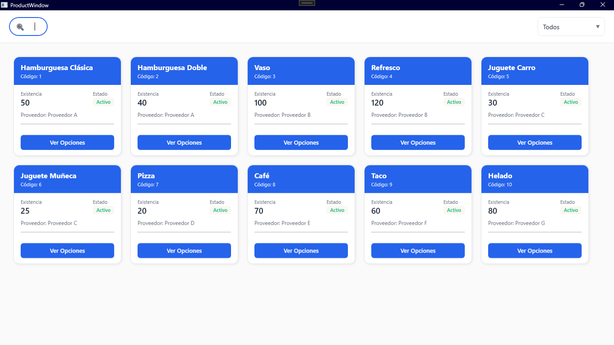
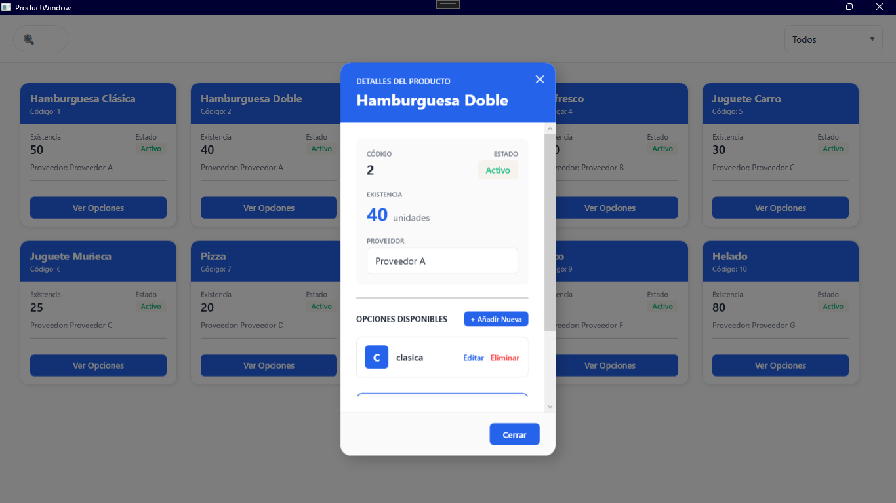

# Sistema de Gestión de Productos

Sistema de escritorio desarrollado en C# (.NET Framework) con WPF para la interfaz gráfica y SQL Server como base de datos. Permite la gestión de productos, usuarios y opciones mediante login, registro con validaciones, filtros de búsqueda y administración de estados.

## Vistas Previa

| Login | Registro de Usuario |
| :---: | :---: |
|  |  |
| **Vista de Productos** | **Detalles y Edición de Opciones** |
|  |  |

## Tabla de contenidos

- [Características principales](#características-principales)
- [Requisitos previos](#requisitos-previos)
- [Estructura del proyecto](#estructura-del-proyecto)
- [Modelos de datos](#modelos-de-datos)
- [Tecnologías utilizadas](#tecnologías-utilizadas)

## Características principales

- **Autenticación Segura**: Sistema de registro y login de usuarios con validaciones de datos en tiempo real y almacenamiento seguro de contraseñas mediante hashing con **BCrypt.Net**.
- **Gestión de Productos**: Visualización de productos con filtros por nombre y estado (Activo/Inactivo). Búsqueda optimizada con debounce para mejorar el rendimiento.
- **CRUD de Opciones**: Funcionalidad completa para **C**rear, **L**eer, **A**ctualizar y **E**liminar (CRUD) las opciones de cada producto desde una ventana emergente (popup).
- **Interfaz Reactiva**: La UI se actualiza en tiempo real al añadir, modificar o eliminar opciones gracias al uso de `ObservableCollection<T>` y el patrón MVVM.
- **Arquitectura MVVM Robusta**: Estricta separación de responsabilidades entre la Vista (XAML), el Modelo de Vista (ViewModel) y el Modelo (clases de datos), utilizando `CommunityToolkit.Mvvm` para una implementación limpia.
- **Inyección de Dependencias**: Configuración centralizada de servicios y ViewModels, facilitando el mantenimiento y las pruebas.
- **Navegación Desacoplada**: Comunicación entre ViewModels y Vistas mediante un sistema de mensajería (`WeakReferenceMessenger`) para una navegación limpia sin acoplar el code-behind.

## Requisitos previos

- .NET Framework 4.8 o superior
- SQL Server 2019 o superior (Express o est�ndar)
- Visual Studio 2022 o superior

## Estructura del proyecto

```plaintext
GestionProductos/
│
├───Common/
│   ├───BooleanToVisibilityConverter.cs  # Convierte bool a Visibilidad para la UI
│   ├───FirstLetterConverter.cs        # Extrae la primera letra de un string
│   └───LoginSuccessMessage.cs         # Mensaje para navegación desacoplada
│
├───Models/
│   ├───Opcion.cs                      # Modelo de datos para las opciones
│   ├───Producto.cs                    # Modelo de datos para los productos
│   └───Usuario.cs                     # Modelo de datos para los usuarios
│
├───Services/
│   ├───DbContextFactory.cs            # Fábrica para crear instancias de DbContext
│   ├───GestionProductosContext.cs     # DbContext de Entity Framework
│   ├───IOptionService.cs              # Interfaz para el servicio de opciones
│   ├───IProductService.cs             # Interfaz para el servicio de productos
│   ├───IUserService.cs                # Interfaz para el servicio de usuarios
│   ├───OptionService.cs               # Lógica de negocio para opciones (CRUD)
│   ├───ProductService.cs              # Lógica de negocio para productos
│   └───UserService.cs                 # Lógica para registro y login con BCrypt
│
├───ViewModels/
│   ├───AuthViewModel.cs               # ViewModel para la ventana de autenticación
│   └───ProductViewModel.cs            # ViewModel para la ventana de productos
│
├───Views/
│   ├───AuthWindow.xaml                # Vista para login y registro
│   └───ProductWindow.xaml             # Vista principal para la gestión de productos
│
└───App.xaml.cs                        # Punto de entrada y configuración de DI
```

## Modelos de datos

[](https://mermaid.live/edit#pako:eNqNU01v2zAM_SsCr7ODKHbiRIcCXdphO7TbIbsMuqgW4wi1yUCWi6ZB_vv8kWYt3AK7iY8f75Eij5CzRVAQx7GmnGnrCqVJiNIcuAlKYPnYmWGHFSpByLE1vodK5sce0TQkl6aub5wpvKk0WecxD45JbL520UL0fvHLs23ywOKoSYcO_-IoiDVbV_AFqoN3VIh7rh48vgu8fXZ1QMqducAPzKW4rYOxnxRoOZ8QLftByOmtnp_7vBP5Xs0PO8D_oWcQ_trVx5pGpL_rxnjHI9Yz_jHtJ87rPZalG7e-Zgre1Ejmu6l3Y6_3OMrZYIlbpn_4jQm4cRWKb5jvzNqjGcbypqPLh2qQGkQcX7WvytChNc7DVaJdrOCQ2tFBBIV3FlTwDUZQoa9MZ8KxK6ehXzQNqn32iwaaTm3O3tAf5uo1zXNT7EBtTVm3VrO3rc7z6l1CkCz6NTcUQEnZlwB1hGdQSTqZymQqs3SeZcs0SyI4gJolE7mQyUquFotlMs2yUwQvPaecyNUyS5NMLtLZNJnP5hGgdYH93XA8_Q2d_gKB_xH0)


**Descripción**:
- **Usuario**: Almacena la información de los usuarios. La propiedad `ContrasenaHash` guarda el hash de la contraseña generado por BCrypt como un `string`.
- **Producto**: Contiene los datos principales de los productos. La propiedad `Opciones` es una `ObservableCollection` para permitir la actualización en tiempo real de la UI.
- **Opcion**: Representa las opciones configurables asociadas a cada producto.

## Tecnologías utilizadas

- **C# (.NET Framework 4.8)**: Lenguaje principal
- **WPF**: Interfaz gráfica
- **SQL Server**: Base de datos
- **Entity Framework 6.5.1**: ORM para la base de datos
- **BCrypt.Net-Next 4.0.3**: Hashing de contraseñas
- **CommunityToolkit.Mvvm 8.4.0**: Soporte para MVVM
- **Microsoft.DependencyInjection 9.0.9**: Inyección de dependencias
- **Microsoft.Extensions.Logging 9.0.0**: Logging
- **Microsoft.Extensions.Logging.Debug 9.0.0**: Depuración